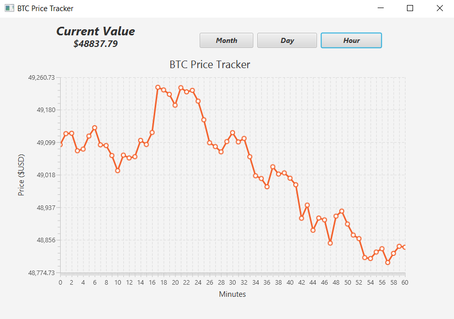

# Bitcoin (BTC) Price Tracker

# Overview

- JavaFX application to track the price of Bitcoin (ticker symbol BTC).
- Toggle between monthly, daily, and hourly BTC prices.
- Utilized the cryptocompare.com public API to obtain prices. 

# How to use
- Clone repository on your local device.
- Open BTC_PriceTracker in preferred code editor (IntelliJ works nicely).
- Right click on the Application.java file and select "Run Application.main()".

# Preview

# Summary

-- UPDATE SUMMARY

- Detailed Features:
    - Toggle between Monthly, daily, and hourly price views.
    - Asynchronously load UI to improve application loading speeds.
    - Using Google's GSON API to pull BTC prices from cryptocompare.com's public API.
      - Used string interpolation to pull price intervals formatted in milliseconds for monthly, dayly and hourly BTC prices.  
  - Dynamically adjust Y-axis for changes in price.
# Author

Brandon Chuck | Full Stack Developer | [LinkedIn](https://www.linkedin.com/in/brandonchuck/) | [Personal Website](https://www.brandonchuck-dev.com)
